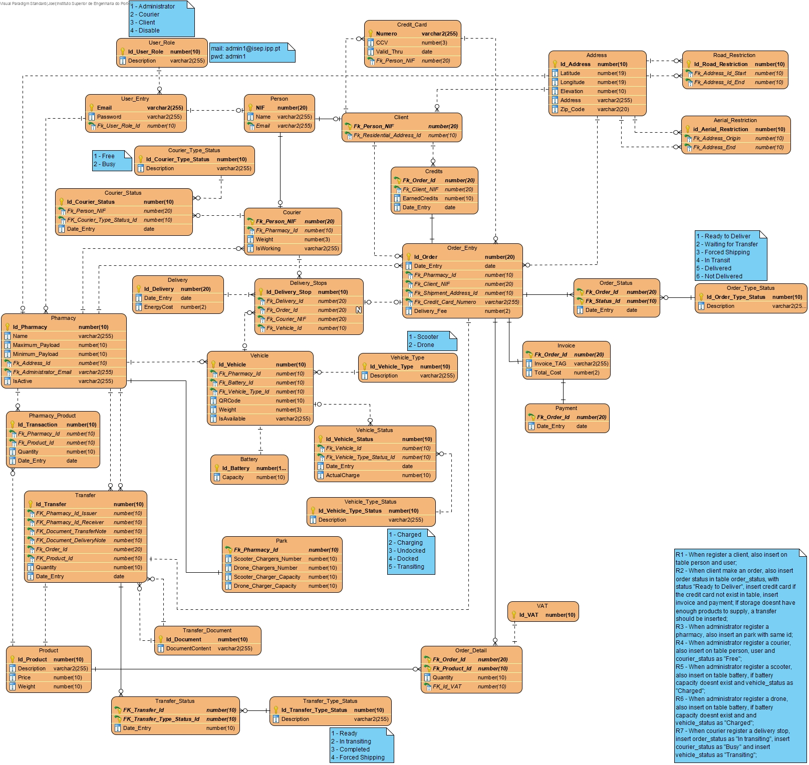
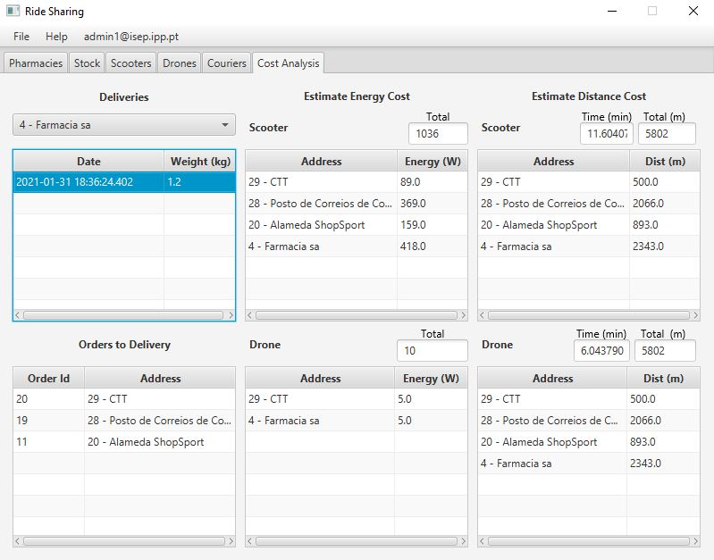
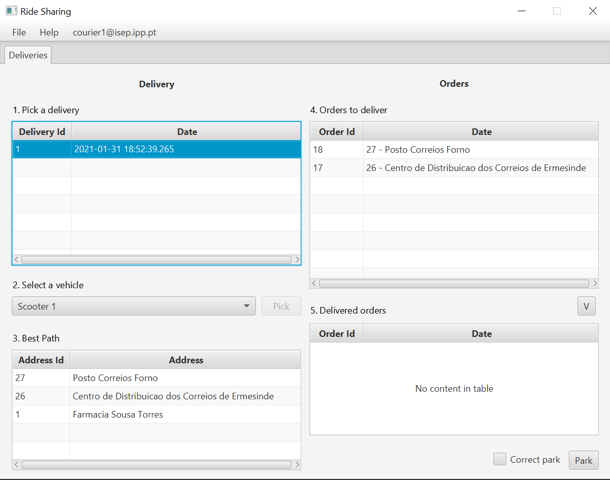

# LAPR3 Project

## 1. Work group members ###

This work group is composed of the following members

| Student number	     | Name			          |
|----------------------|--------------------|
| **1191587**          | Rui Peixoto        |
| **1171482**          | Helder Ferreira    |
| **1100241**          | Joel Ribeiro       |
| **1181427**          | Catarina Serrano   |
| **1090552**          | Daniel Teixeira    |
| **1141729**          | António Freitas    |

An index to the documented use cases, along with the FURPS and several other documents of this project can be found [here](Index.md).

## 2. Project Overview

The developed system intends to be a possible solution to support the delivery of pharmaceutical
products and the management of pharmacies. The goal is to support the delivery of self-injecting SARS-CoV-2 vaccines to each of the pharmacies' clients.

This system is developed for the usage of 4 types of actors (users):

* **Administrator**;

* **Courier**;

* **Client**;

* **Unregistered user**. 
 
The features that are available for each user can be seen on the [Use Case Diagram](DUC.md).
The main ones are:

* An **unregistered user** being able to register as a **client**, therefore gaining the availability to register a home delivery; earning credits for each payed order and the ability to use them on future ones to decrease their price;

* A **courier** is able to park the scooter he used in order to charge its battery, thus receiving an email notification with the correspondent information and to check the amount of energy required to perform a delivery run by order;

* The **administrator** role is the one with the most features and options, such as adding/updating couriers, scooters and drones, registering a new pharmacy, simulating the park system, managing stocks and transfering products between pharmacies. Also, he can generate invoices related with each client's orders, analyse the delivery details and data concerned with the energetic cost of delivering a given order either by scooter, or by order. Moreover, it's important to notice that the administrator can check the influence of both weather and road (terrain elevation, for example) conditions on the previously referred energetic cost.

The current accounts built-in to the system for demonstration purposes are:

* Administrator:
user: **admin1@isep.ipp.pt** | pw: **admin1**

* Courier:
user: **courier1@isep.ipp.pt** | pw: **courier1**

* Client:
user: **client1@isep.ipp.pt** | pw: **client1**

The system can be interacted with either through a visual UI (developed with JavaFX) or through an IDE terminal/console command line with input files and generating the estimation data to output files.

Below there's the domain model of our project:

As it can be seen, we have employed several types of relations between classes and concepts. For example, when it comes to drones and scooters, since they shared a lot of attributes it made sense they would extend a superclass named "Vehicle". Each vehicle has a battery with a selected capacity, thus this exemplifies a composition relationship.

The "user", "person" and "courier"/"client" also represent an inheritance relationship, as in, "person" extends "user". Both "courier" and "client" extends "person".

Below there's the entity-relationship model of our database:

As it has already been stated, our project can be run through a GUI designed in JavaFX. Below there's an image showing how it looks like:

As it can be seen, this is the "home window". Here the user acts as an unregistered user, being able to see the products available in each pharmacy, yet not capable of ordering them. To do that, he must first register himself as a client.
In the form of tabs the user can, if he wishes to, login as an administrator in order to execute several operations, such as adding vehicles (either scooters or drones), adding couriers or even getting the energetic cost of a delivery to a given location.

Regarding the Administrator, below it is presented an image showing the first window that appears when the user logs in as an Administrator using the previously mentioned credentials (username: **admin1@isep.ipp.pt**; password: **admin1**):

When the administrator selects a pharmacy (from the provided list), each of the textfields will be immediatly filled with its data, at which point he can remove the selected pharmacy, or edit any information he wants. Otherwise, if he wishes to, he can add a new one by filling the blank fields.

On the tab "Stocks" the administrator can check the products in stock in the selected pharmacy (from a list of pharmacies) along with its quantities and unique identifiers (id), as it can be seen in the following image:

Moreover, the administrator can add new products, or even edit existing ones, by filling the text fields. In addition to this, he can also remove a chosen quantity of a product and transfer one to another pharmacy.

Below there's a picture that exhibits the Scooters' tab (we'll not show the Drones' one as it is similar). The administrator is able to add, remove or update the information of a scooter to the selected pharmacy (as long as there exists at least one obviously). Moreover, he can see the scooters that are assigned to the selected pharmacy, if there are any.
By removing one vehicle it'll not show up on the list, thus being unavailable to be used in future deliveries.

The following image depicts the Couriers' tab, which also allows the administrator to check the ones assigned to a given pharmacy. As it also happens with scooters and drones, he's able to add new couriers by filling the blank fields with adequate data (that is properly validated), or to edit/remove existing ones.
When a courier isn't active its status will show it.

Lastly, when it comes to the functions of the administrator, he can also execute a cost analysis of the deliveries, especially when it comes to the energetic cost of each one of those (either to only one customer, or to several ones). There are several factors that impact that analysis such as the payload weight (which can only sum up to a pre-defined maximum), the type of vehicle (a drone, or a scooter) and, evidently, both the weather and terrain conditions. For example, the energetic cost will increase as the road elevation increases, thus rendering the delivery run shorter than if the average elevation was close to 0. 
There are several other factors that impact that energetic cost and, more importantly, the decision between making a delivery run either through a scooter or through a drone. As it is known, both of them have notable differences ranging from different average velocities (due to the factor road vs air), to their battery capacities also being different, their aerodynamic coefficient is also different, thus rendering a contrasting aerodynamic efficiency.

Bearing that in mind, our Cost Analysis tab shows exactly what has been described in the previous paragraph: for the same selected delivery, the application calculates and shows the cost analysis for the two vehicles.

The referred tab is shown below:

The client, once he's registered (for the example purpose, the credentials used were the already stated ones: username: **client1@isep.ipp.pt**, password: **client1**), can check the available products in the pharmacy and the amount of points/credits he has in order to discount them, if he wants, on the next purchase, so that he can pay a lower price.
As it can be seen, the UI is very similar to the "home window". We have decided this to be the case, as it made more sense to us that each unregistered user ought to be able to check the available products, but unable to actually buy them.
With that being said, this UI is very straightforward. Its image can be seen below:

And last but not least, the application also provides a tab to each courier. 
As it can be seen, once a courier logs in (remember that a courier is assigned to a certain pharmacy) he can check all the deliveries ready to be made and select one of them. By doing this he'll be able to select a vehicle (either a scooter or a drone) to use to execute a delivery run. Since each delivery run has obviously different stopping points, the system will provide the courier with the best path to make for each delivery selected. 
This path is made clear by showing the stopping points ordered by the distance from the pharmacy. 
The tab also shows the orders that each selected delivery has (and even transfer from one pharmacy to another).
Finally, the system will automatically update the delivered orders.

The mentioned tab can be seen below:

