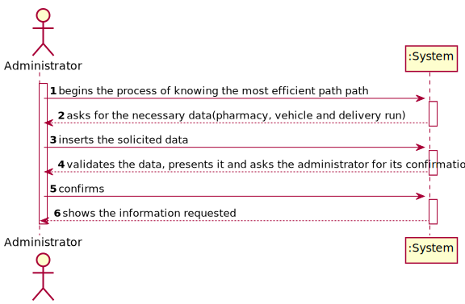

# NANB9-12 Administrator - Know the most efficient path for a delivery run
 =======================================

## 1. Requirements

**User Story:**
As an administrator I want to know the most efficient path for a given delivery run. 

#### Information about requirements from client through the project assignment and meetings
- "Administrator should be registered in system before."
- "At least one pharmacy should already be registered."
- "Several products must already be registered into the system."
- "At least one drone, or one scooter, must already be registered on the system."
- "Clients should already be registered and made orders in order to calculate a delivery run."

## 2. Analysis

### Considerations for the User Story
To complete this use case, several parameters regarding road and weather conditions must be taken registered as well as addresses.

