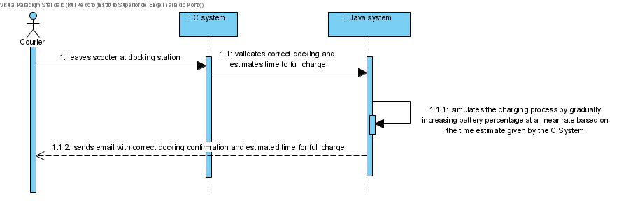
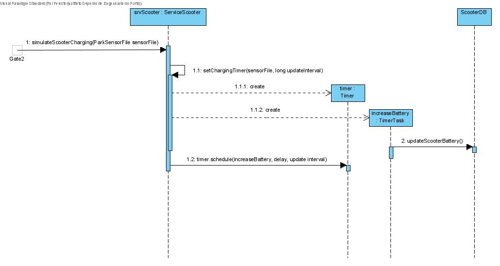
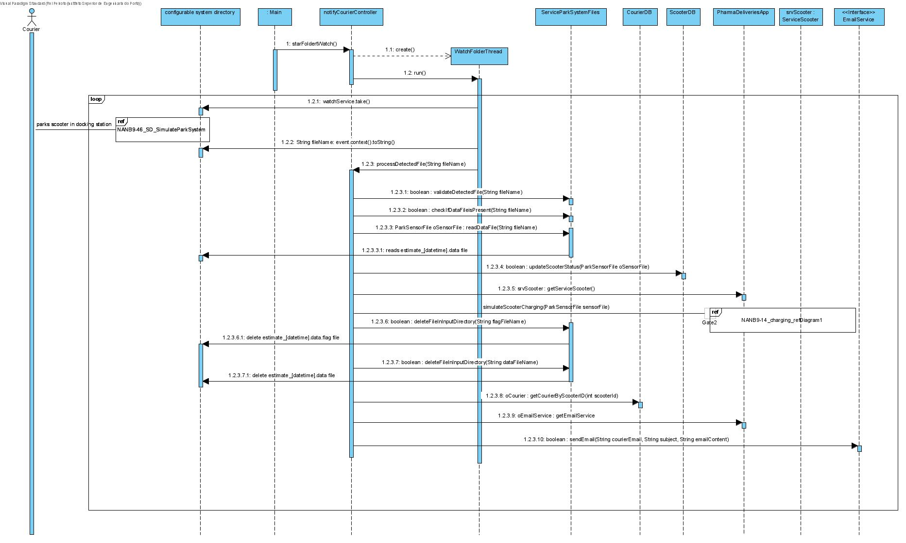

# NANB9-14 (incl 57,136-138) - Courier - Charge scooter when it is parked
 =======================================

# 1. Requirements

As a courier I want the scooter to charge when I park it (in a charging spot) so it will be fully charge when I need it for the next deliveries.

# 2. Analysis

# 3. Design

## 3.1. Sequence Diagram

