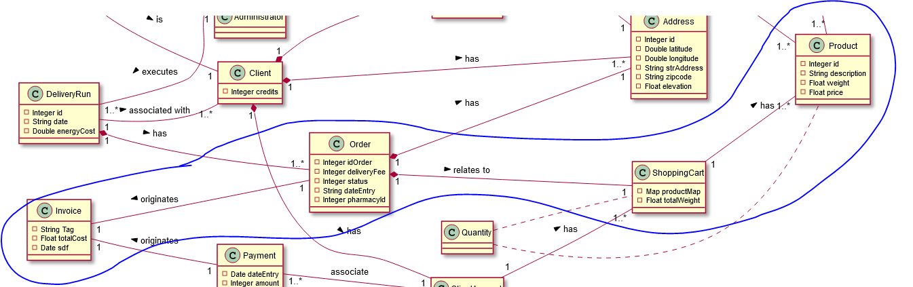
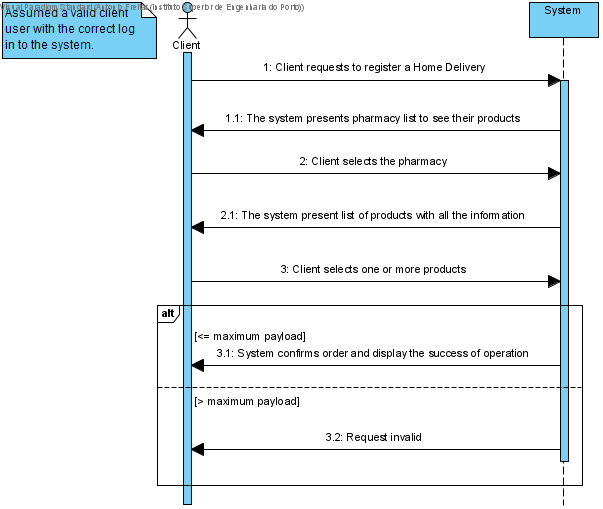
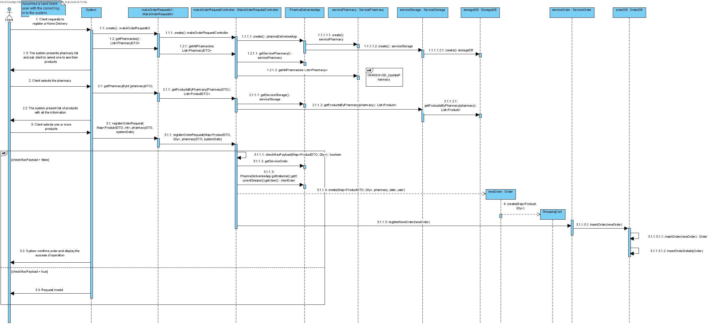
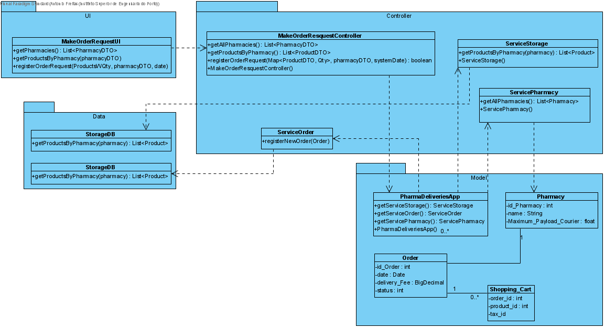

# NANB9-17 Client - Make a request for home delivery
 =======================================

## 1. Requirements

**User Story:**
As a client I want to use home delivery system to receive the requested products at home. Also i want earn credits for each purchase.

#### Information about requirements from client through the project assignment and meetings
- "Clients must register to make online orders."
- "A fee is charged for home deliveries."
- "Clients earn credits when using the home delivery system"
- "Online orders are limited to the maximum payload established for the deliveries" - https://moodle.isep.ipp.pt/mod/forum/discuss.php?d=3352
- "Clients must register themselves on the application. Every registration is free of charge but requires the client’s address."
- "When an order cannot be entirely fulfilled, the system should notify the client, and remove the item that does not have enough stock. An invoice/receipts should be issued for every order"
- "Clients earn credits from each online order"
- Clients can only request orders for their home address https://moodle.isep.ipp.pt/mod/forum/discuss.php?d=3333

## 2. Analysis

### Considerations for the User Story
It's assumed that the client wants to register a request of pharmaceutical products for home delivery. For this the client needs to be registered in the system with all the necessary requirements of this functionality (related to the NANB9-23 US https://jira.dei.isep.ipp.pt/browse/NANB9-23).
With the registration and with the login performed the client will them be able to access the pharmacy in the system and choose the products he requires.
The request order will be limited to the maximum payload registed in the system allowed for home delivery (NANB9-21 https://jira.dei.isep.ipp.pt/browse/NANB9-21). It's assumed that the system will not allow the maximum payload to be exceeded with a warning to the client.
Following the information gathered with the project client the system will allow the request to be submitted even if the pharmacy does not have the necessary stock with the valitation beeing made later by the system making the correction and informing the customer (this will be addressed by another US).
In summary this User Story is considered for the functionality of the client beeing able to submit a request of products to be delivered at home.

In order to have severall products referred to a order

**Order Entry - required attributes**
- Identification of the orders
- Date of the order submission
- Pharmacy identification - to which pharmacy was the order requested
- Shipping address
- Delivery fee applied

**Shopping Cart**
- Identification of the order Entry
- Identification of the product
- Quantity of the product
- Applied TAX to the product price

**Further Clarification needed**
- Who and what rules specify the delivery fee to be applied?
**Reply:** "At this time it is fixed, as it is at a promotional value. In the future, we do not know when, it will be indexed." https://moodle.isep.ipp.pt/mod/forum/discuss.php?d=3266
Further change to the Domain Model and ERD to add delivery fee to the Farmany and then beeing able to be registed in each order the applied delivery fee.

*Neste secção a equipa deve relatar o estudo/análise/comparação que fez com o intuito de tomar as melhores opções de design para a funcionalidade bem como aplicar diagramas/artefactos de análise adequados.*

*Recomenda-se que organize este conteúdo por subsecções.*

## 3. Design

*Nesta secção a equipa deve descrever o design adotado para satisfazer a funcionalidade. Entre outros, a equipa deve apresentar diagrama(s) de realização da funcionalidade, diagrama(s) de classes, identificação de padrões aplicados e quais foram os principais testes especificados para validar a funcionalidade.*

*Para além das secções sugeridas, podem ser incluídas outras.*

SRP - Single Responsability Principle (each class has only one Responsability)

Event-sourcing

### 3.1. System Sequence Diagram

### 3.2 Sequence Diagram
[Vectorial NANB9-17_SD_Client-MakeRequestForHomeDelivery.pdf](./NANB9-17_SD_Client-MakeRequestForHomeDelivery.pdf)

### 3.3. Class Diagrams
[Vectorial NANB9-17_CD_Client-MakeRequestForHomeDelivery.pdf](./NANB9-17_CD_Client-MakeRequestForHomeDelivery.pdf)

# 6. Observations

This US as then been updated with new requirements announced in Sprint 2 and 3 to the
[Client - Purchase products available through back order](../NANB9_159/NANB9_159_Purchase_products_available_through_back_order.md)
