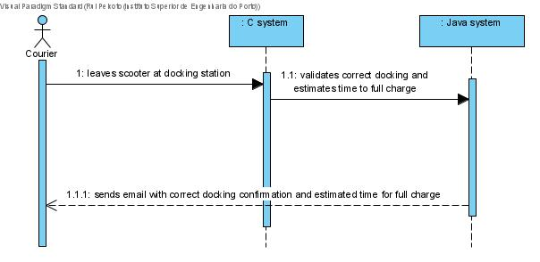
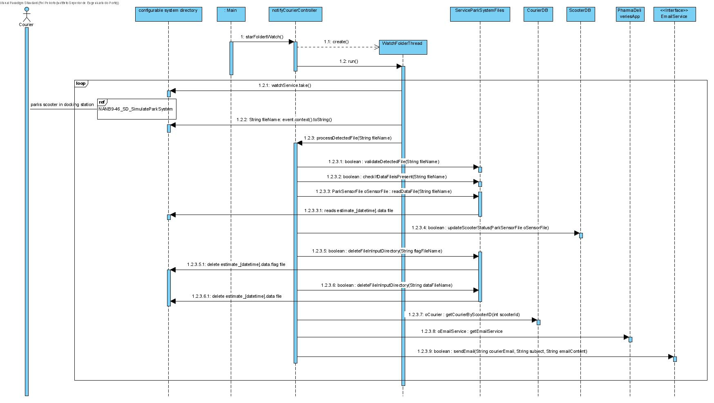
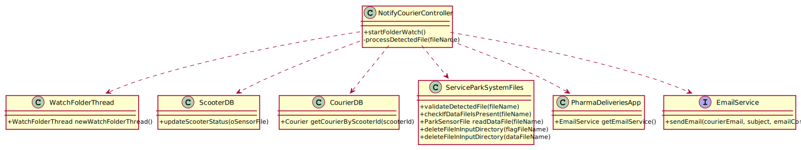

# NANB9-18 (incl 62,140,141,142) - Courier - Notify the courier when the scooter is correctly docked
 =======================================

# 1. Requirements

As courier I want to receive a notification when scooters are docked to the parking equipment and as well as an estimate time for full charge.

# 2. Analysis

# 3. Design

## 3.1. Sequence Diagram

*Nesta secção deve apresentar e descrever o fluxo/sequência que permite realizar a funcionalidade.*

## 3.2. Class Diagrams

## 3.4. Tests

# 6. Observations

