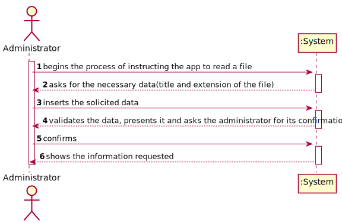

# NANB9-213 Administrator - I want to be able to use the app with file input
 =======================================

## 1. Requirements

**User Story:**
As an administrator I want to be able to use the app with file input. 

#### Information about requirements from client through the project assignment and meetings
- "Administrator should be registered in system before."
- "The application should be able to support the option of reading files."

## 2. Analysis

### Considerations for the User Story

