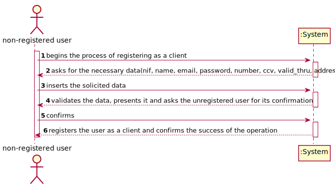
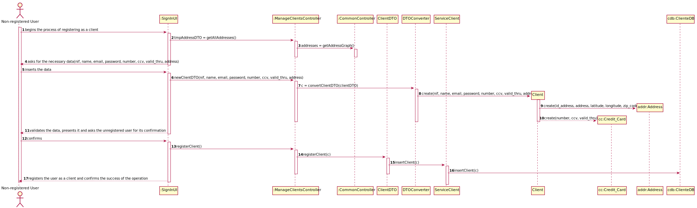
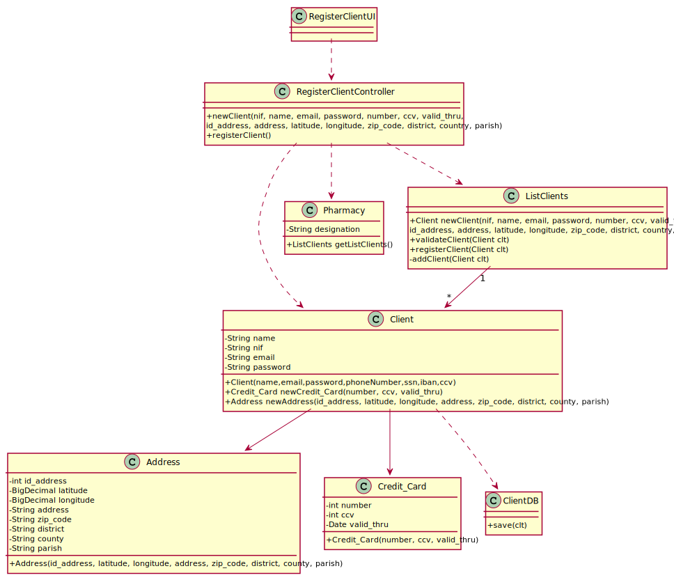

# NANB9-23 - Register Client
 =======================================

# 1. Requirements

As a non-registered user I want to register myself as a client on the system

# 2. Design

## 2.1. Sequence Diagram

## 2.2. Class Diagrams

