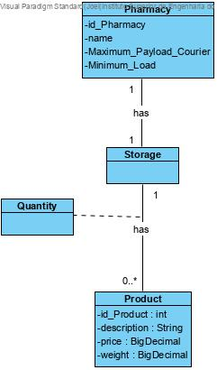
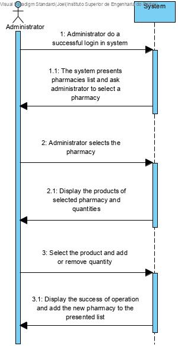
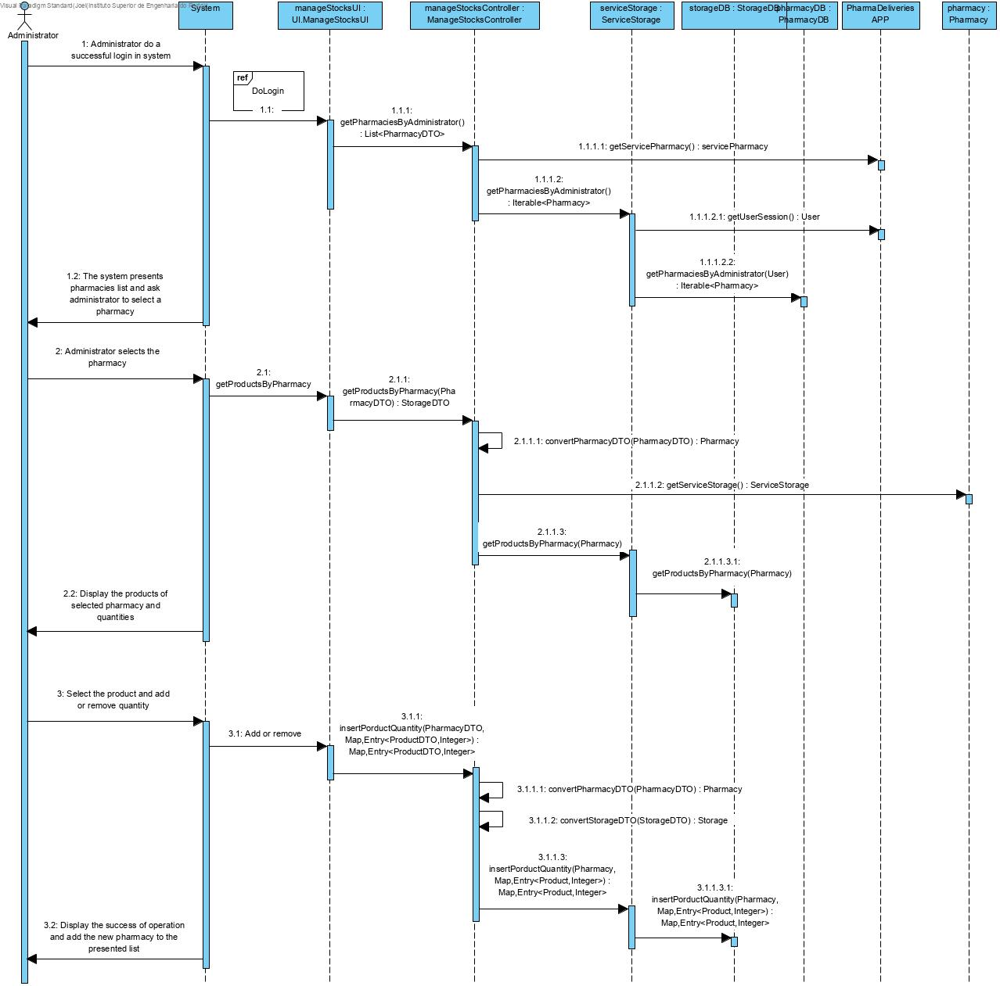
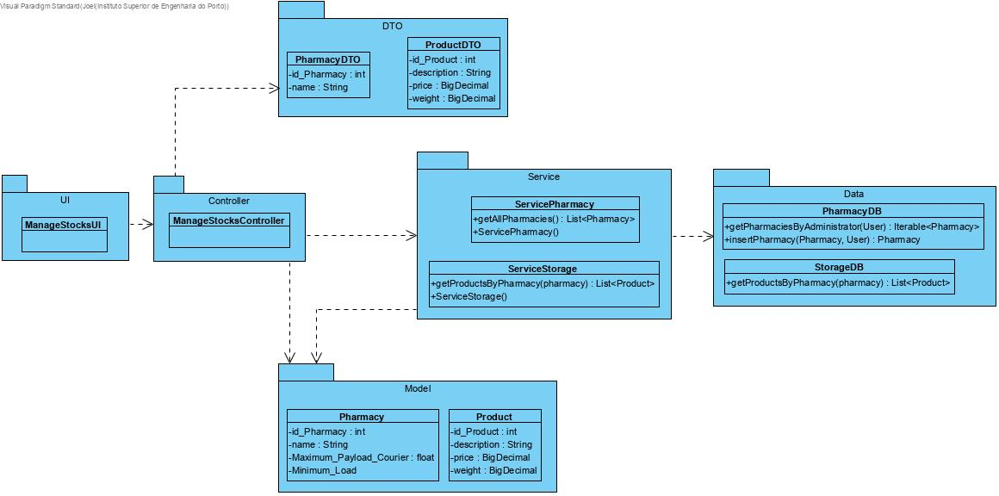

# NANB9-47 Administrator - Manage Stocks
 =======================================

## 1. Requirements

**User Story:**
As an administrator i want to manage product stocks when received at pharmacy. 

#### Information about requirements from client through the project assignment and meetings
- "Administrator should be registered in system before."
- "Administrator should be registered before insert products."
- "Administrator could register products if they dont exist."

## 2. Analysis

### Considerations for the User Story
For this use case it is assumed that the administrator is already register in system, pharmacy created and all the products exists.
To complete the update of product quantities, the administrator should input the number of products received.

**Product - required attributes**
- Name
- weight
- Price

## 3. Design
SRP - Single Responsability Principle (each class has only one Responsability)

Event-sourcing

### 3.1. System Sequence Diagram

### 3.2 Sequence Diagram

### 3.3. Class Diagrams

# 6. Observations

*
