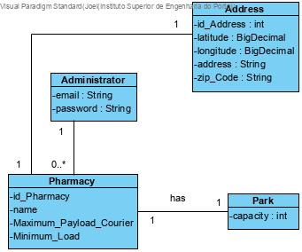
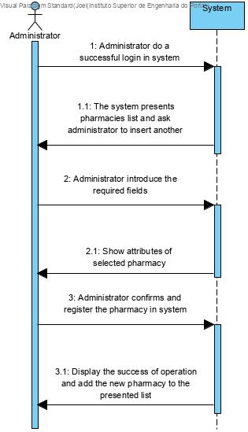
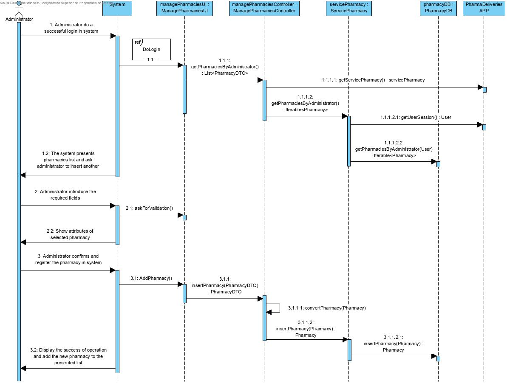
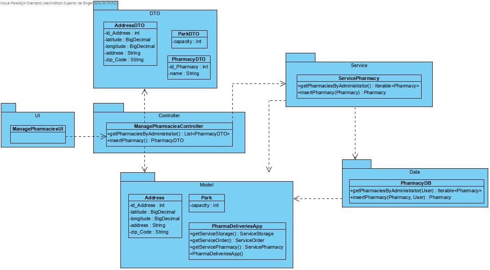

# NANB9-9 Administrator - Add a new pharmacy and set park limit
 =======================================

## 1. Requirements

**User Story:**
As an administrator i want to register a new pharmacy and set park limit for pharmacy's scooters. 

#### Information about requirements from client through the project assignment and meetings
- "Administrator should be registered in system before."

## 2. Analysis

### Considerations for the User Story
For this use case it is assumed that the administrator is already register in system. 
To complete the registration of a new pharmacy, the administrator should input all properties requested by app.

**Pharmacy - required attributes**
- Name
- Park capacity
- Maximum courier payload
- Minimum weight for ride
- Address
- Zip Code
- Latitude
- Longitude

## 3. Design
SRP - Single Responsability Principle (each class has only one Responsability)

Event-sourcing

### 3.1. System Sequence Diagram

### 3.2 Sequence Diagram

### 3.3. Class Diagrams

# 6. Observations

*
