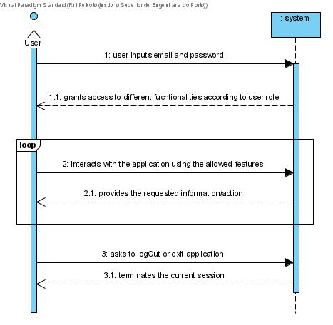
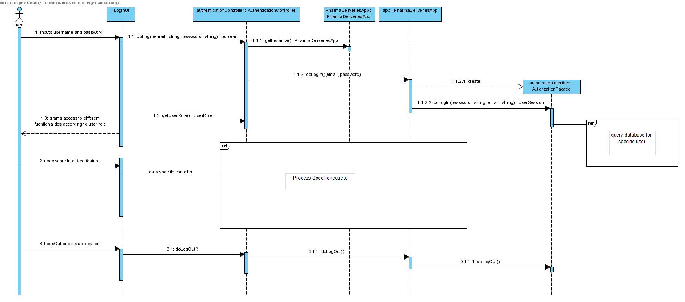

# NANB9-90 (incl 91-94) - Administrator - User Login System
 =======================================

# 1. Requirements

As administrator I want the application to have a user login system, so I can assign different roles to different users, in order to grant access to different functionalities according to the role of the user using the application.

# 2. Analysis

# 3. Design

## 3.1. Sequence Diagram

